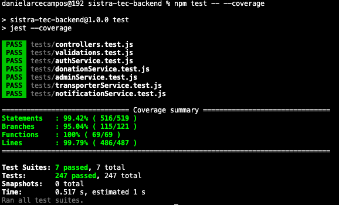

# SISTRA-TEC — Backend

API REST construida con Node.js, Express y PostgreSQL para la gestión y trazabilidad de donaciones.

## Requisitos previos

- Node.js 18+
- PostgreSQL

## Instalación

```bash
npm install
```

## Variables de entorno

Copia el archivo de ejemplo y completa los valores correspondientes:

```bash
cp .env.example .env
```

| Variable | Descripción |
|----------|-------------|
| `PORT` | Puerto del servidor (default: 3000) |
| `FRONTEND_URL` | URL del frontend para CORS |
| `DB_USER` | Usuario de PostgreSQL |
| `DB_PASSWORD` | Contraseña de PostgreSQL |
| `DB_HOST` | Host de PostgreSQL |
| `DB_PORT` | Puerto de PostgreSQL (default: 5432) |
| `DB_NAME` | Nombre de la base de datos |
| `JWT_SECRET` | Clave secreta para firmar tokens JWT |

## Correr el proyecto

### Desarrollo (con hot reload)

```bash
npm run dev
```

### Producción

```bash
npm start
```

## Estructura del proyecto

```text
src/
├── server.js        # Punto de entrada
├── app.js           # Configuración de Express
├── config/          # Conexión a la base de datos
├── controllers/     # Manejo de requests HTTP
├── services/        # Lógica de negocio
├── models/          # Queries a la base de datos
├── routes/          # Definición de rutas
├── middleware/      # Auth, validación y manejo de errores
├── validations/     # Esquemas Joi
├── utils/           # Funciones reutilizables
└── errors/          # Clases de error personalizadas

```

## Pruebas unitarias

El proyecto cuenta con pruebas unitarias automatizadas utilizando **Jest**, enfocadas en las capas de lógica del backend.

### Ejecutar las pruebas

```bash
npm test
```

### Ejecutar las pruebas con cobertura

```bash
npm test -- --coverage
```

### Resultados de cobertura

| Métrica | Cobertura |
|----------|----------:|
| Statements | 99.42% |
| Branches | 95.04% |
| Functions | 100% |
| Lines | 99.79% |

### Resumen de ejecución


